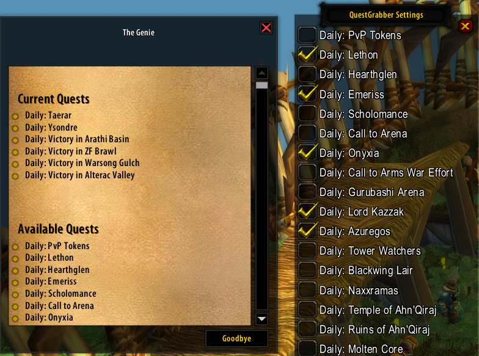

# QuestGrabber

The QuestGrabber addon is designed to enhance the questing experience in World of Warcraft version 1.12.1 
by providing automation features for frequently repeated quests, making quest selection and completion more streamlined

### It consists of two main Lua script files:

1. QuestGrabber.lua: This file creates a user interface for managing quests, allowing players to select which quests to automatically accept. It registers event handlers for various quest-related events and provides functionalities for displaying available quests, managing quest selection, and automatically accepting quests.
2. QuestTurnIn.lua: This file complements the functionality of QuestGrabber.lua by providing automation features for quest completion. It registers event handlers for quest progression, completion, and NPC interactions related to quests. It allows players to automatically complete quests based on predefined settings and player interactions.

+ Questgrabber.lua
Idea and creation by Anduidin, with some tweaks and visual fixes by Pumpans.
+ QuestTurnIn.lua
Created by Pumpans.

## Features
+ User interface for managing quests
+ Automatic quest acceptance based on player preferences
+ Automatic quest completion based on player settings and interactions
+ Integration with NPC interactions for streamlined questing experience

## Installation
1. Download the addon files from GitHub.
2. Extract the contents of the zip file into your WoW Classic Interface\AddOns\QuestGrabber_1.12.1 directory
3. Launch World of Warcraft and ensure that the addon is enabled in the character selection screen.

## Usage
Type "/qg help" in the chat box for help instructions on how to use the addon.

1. Talk to a quest NPC and select the quests you want to automatically collect.
2. Close the NPC quest window and hold Shift while right-clicking the NPC.
3. To turn in quests automatically, hold Shift and right-click the NPC when the quest is completed.
4. Right-click to move the frame.
#### Hold Shift and right-click an NPC to automatically grab or turn in quests upon completion.

## Support
For any issues, feedback, or feature requests, please open an issue on the GitHub repository. License This addon is licensed under the MIT License. Feel free to modify and distribute it according to the terms of the license.
